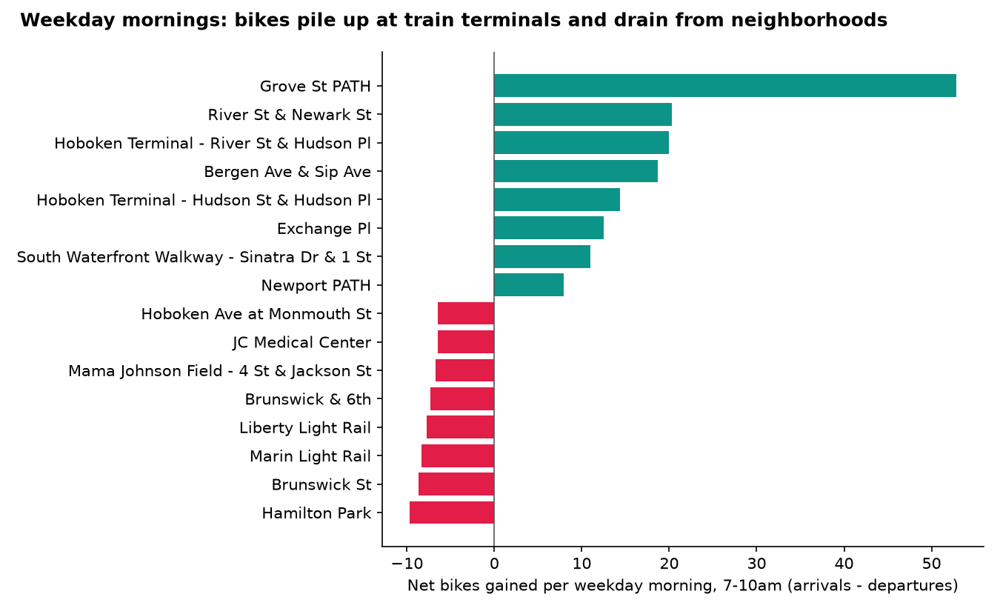
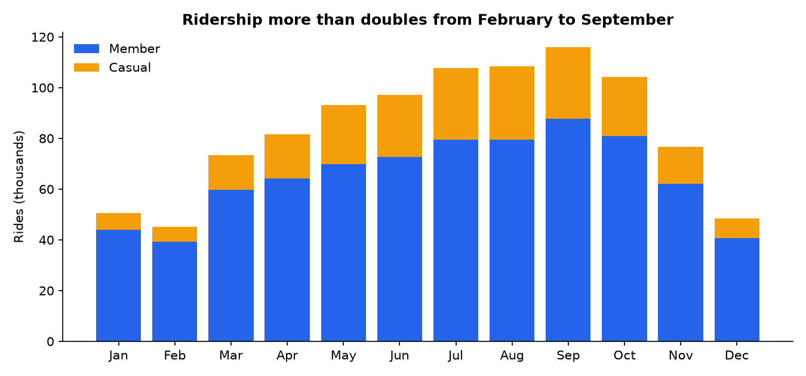
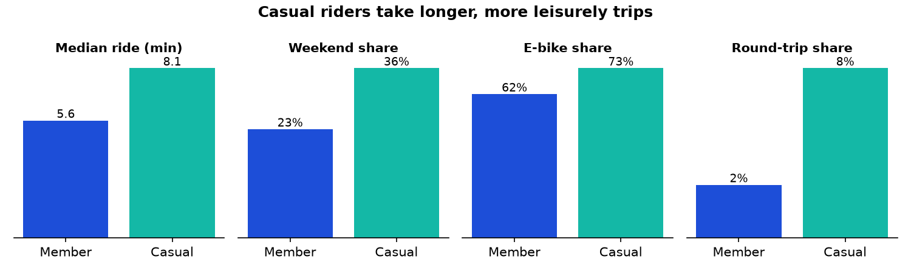
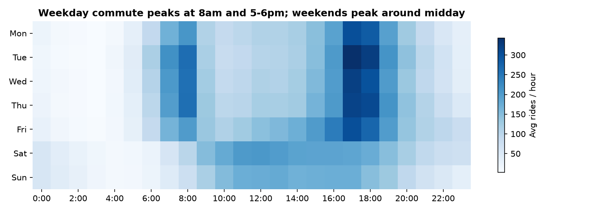

# Citi Bike Jersey City & Hoboken: 2025 Demand and Rebalancing Analysis

**[Live dashboard →](https://ameenagz.github.io/projects/citibike-jersey-city/dashboard/)**

An end-to-end analysis of **1,002,331 bike-share trips** taken in Jersey City and Hoboken in 2025. It goes from the raw monthly files to a cleaned DuckDB database, SQL analysis, charts and an interactive dashboard.



## Business questions

1. **Who uses the system, and how?** Members vs. casual riders.
2. **When is demand highest?** Season, day of week and hour.
3. **Which stations run out of bikes or docks?** The morning imbalance a rebalancing crew has to fix.

## Key findings

| # | Finding | Evidence |
|---|---------|----------|
| 1 | **It's a commuter system.** 78% of rides are by members, the median ride is 6 minutes (~1 km), and weekday demand peaks at 8am and 5-6pm. | `outputs/kpis.csv`, `charts/hour_by_weekday.png` |
| 2 | **Grove St PATH gains ~53 bikes every weekday morning.** Between 7 and 10am it gets 15,780 arrivals vs. 2,005 departures over the year: riders bike to the train. Hoboken Terminal (~34 across its two stations) and Exchange Pl (~13) behave the same way. | `outputs/am_peak_imbalance.csv` |
| 3 | **Neighborhood stations drain at the same time.** Hamilton Park, Brunswick St and the Marin/Liberty light-rail stops each lose roughly 8-10 bikes per morning. 21 stations lose 5+ bikes per morning. | same |
| 4 | **The flow reverses in the evening.** Grove St PATH loses ~45 bikes per weekday between 4 and 7pm. The system partly balances itself, so the problem is timing: docks at the PATH are full by ~9am. | query in *Methodology* |
| 5 | **Demand is very seasonal.** September (116k rides) was 2.6× busier than February (45k). Casual rides grew 4.9× and member rides 2.2×, so casual riders drive the summer peak. | `outputs/monthly.csv` |
| 6 | **Casual riders ride for leisure.** Their rides are longer (8.1 vs 5.6 min median) and more often on weekends (36% vs 23%). They are 3× as likely to end where they started. | `outputs/rider_segments.csv` |
| 7 | **Hoboken and Jersey City are mostly separate networks.** Only 13% of rides cross between the two cities. | `outputs/city_flows.csv` |

## Recommendations

- **Move bikes out of the PATH stations before about 9am.** Taking ~50 bikes out of Grove St PATH and ~35 out of Hoboken Terminal each weekday morning would keep docks open for arriving commuters. Those bikes can go straight to the stations that drain (Hamilton Park, Brunswick St), all less than 1 km from Grove St PATH.
- **Plan rebalancing per city.** With 87% of trips staying inside one city, each city can have its own truck route.
- **Size the fleet and staff for September, not the annual average.** Monthly demand varies 2.6×. Target casual-rider promotions at weekends and summer, when those riders actually show up.
- **Offer casual riders a membership.** They already take e-bikes more often (73% vs 62%), so an e-bike-inclusive membership is a natural offer.

## Charts

| | |
|---|---|
|  |  |



## Methodology

**Data.** [Citi Bike system data](https://citibikenyc.com/system-data) (Lyft), Jersey City files `JC-202501` through `JC-202512`, 1,002,704 raw trips. Each row is one trip: start and end time, start and end station, coordinates, bike type (classic/electric) and rider type (member/casual).

**Data cleaning** (`sql/01_clean.sql`), which removed 373 rows (0.04%):

| Rule | Rows removed | Why |
|---|---|---|
| Ride did not start in 2025 | 2 | The January file includes rides from Dec 31, 2024 |
| Duration under 60 seconds | 7 | False starts or a bike re-docked (Citi Bike's own guidance) |
| Duration over 24 hours | 364 | Lost, stolen or unreturned bikes |
| Missing end station | kept, flagged (4,049) | Real rides (usually e-bikes left outside a dock). Excluded only from station-flow analysis |

A few station IDs appear under more than one spelling of the name. The `stations` table uses the most common spelling for each ID.

**Metrics.**
- *Net per morning* = (arrivals - departures) between 7:00 and 9:59 on weekdays, divided by the 261 weekdays in 2025.
- *Distance* is the straight-line (haversine) distance between the start and end stations, so it understates the distance actually ridden.
- *Rides per hour* on the heatmap divides by the number of times each weekday occurred in 2025.

**Evening reversal (finding 4)**, run against the DuckDB database:

```sql
SELECT count(*) FILTER (WHERE end_station_id = 'JC115')
     - count(*) FILTER (WHERE start_station_id = 'JC115') AS net_pm
FROM trips
WHERE NOT is_weekend AND hour BETWEEN 16 AND 18 AND NOT missing_end;
-- -11,685 over the year  ->  about -45 per weekday
```

**Limitations.** The data records trips, not dock capacity or the times a station sat empty or full. That means it shows where rebalancing is *needed*, not how often riders were actually turned away. Rebalancing trucks moving bikes aren't in the data either.

## Project structure

```
citibike-jersey-city/
├── pipeline/
│   ├── 01_download.py      # fetch the 12 monthly zip files from Citi Bike's S3 bucket
│   ├── 02_build_db.py      # load CSVs into DuckDB and run the cleaning SQL
│   └── 03_analyze.py       # run analysis SQL -> outputs/*.csv, charts/*.png, dashboard/data.json
├── sql/
│   ├── 01_clean.sql        # trips + stations tables
│   ├── 02_kpis.sql
│   ├── 03_monthly.sql
│   ├── 04_hour_by_weekday.sql
│   ├── 05_rider_segments.sql
│   ├── 06_top_stations.sql
│   ├── 07_am_peak_imbalance.sql
│   └── 08_city_flows.sql
├── outputs/                # query results (CSV)
├── charts/                 # static charts (PNG)
├── dashboard/              # interactive page (Chart.js + Leaflet), reads data.json
├── data/                   # raw CSVs + DuckDB file, created by the pipeline (git-ignored)
├── requirements.txt
└── README.md
```

## Reproduce it

```bash
cd projects/citibike-jersey-city
pip install -r requirements.txt
python pipeline/01_download.py    # ~35 MB download, ~220 MB unzipped into data/ (git-ignored)
python pipeline/02_build_db.py
python pipeline/03_analyze.py
python -m http.server             # then open http://localhost:8000/dashboard/
```

**Tools:** Python, DuckDB (SQL), pandas, Matplotlib, Chart.js, Leaflet.

*Trip data © Lyft Bikes and Scooters, LLC, used under the [Citi Bike data license agreement](https://citibikenyc.com/data-sharing-policy).*
